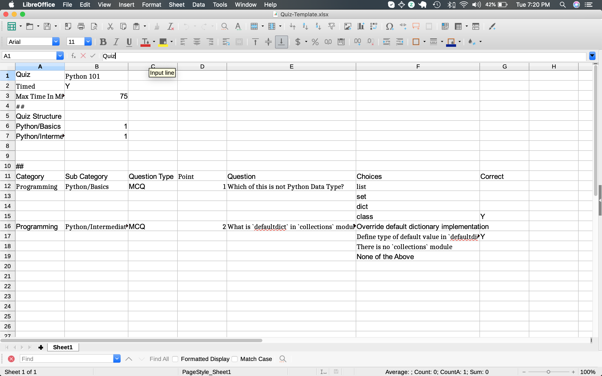

# Ridlr

Ridlr is simple Online Tutoring & Quiz application written in Django

## Setting up

Ridlr setup is relatively simpler. It used `Django` for API layer, specifically we're using [Django REST Framework](https://www.django-rest-framework.org/). Frontend is written using `ReactJS`.

### Backend

1. Create virtualenv `python3.7 -m venv venv`
1. Activate virtualenv `source ./venv/bin/activate`
1. Create Database `cd webapp/ridlr && python manage.py migrate`
    1. NOTE: Change `settings.py` if you would like to run Ridlr with different Database
1. Create Superuser `python manage.py createsuperuser`
1. Load Quiz using following management command `python manage.py load_quiz ./master_templates/Quiz-Template.tsv`
    1. Replace with any Quiz Template that you might have created
1. Start Django `python manage.py runserver 0.0.0.0:8000`

### Frontend

1. Change to right directory `cd webapp/ridlr/frontend/ridlr`
2. Install Dependencies `yarn install`
3. Start the frontend `yarn serve`

## Models

1. `Category`: Category related to a Quiz. E.g. `Programming`
1. `SubCategory`: Sub-Category associated with Quiz E.g. `Python/Collections`
1. `Quiz`: Quiz is self-explainatory
1. `QuizStructure`: It is the structure that is used to build `QuestionBank`. It basically tell us how many questions of a given `SubCategory` do we need to include.
1. `QuestionType`: Right now its only `MCQ` {Multiple Choice Question}, we will be implementing `Open` and `Code` questions 
1. `Question`: Object of Question that gets added to `QuestionBank`
1. `Choice`: Object of Choice associated with `Question` and information if its correct
1. `QuestionBank`: This gets generated and rendered to frontend via API
1. `Invitation`: We use Invitation codes as opposed to Passwords for authenticating users.
1. `TestSession`: Meta-data related to test sessions. E.g. When a given Test Session got started and completed
1. `QuestionResponse`: Log of all responses for a given Question. This is used for audit-trail.

## Quiz Template Creation Guide

A typical Quiz Template looks like follows

Key things to note:

1. `Quiz Name`
1. `Timed`: Tells if the Quiz is Timed
1. `Max Time In Mins`: If Quiz is timed, what is the maximum allowable time?
1. `Quiz Structure`: In this section we have one row per `Sub Category`.
    1. E.g. `Python/Basics	1` implies select one question of category `Python/Basics`
1. `Category	Sub Category	Question Type	Point	Question	Choices	Correct` is where you start populating your quiz database